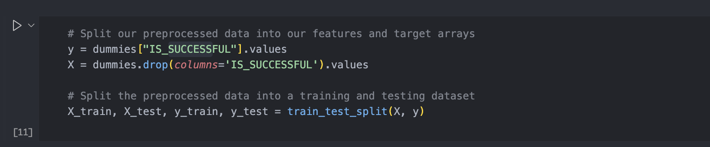

# Deep Learning Challenge: Model Report

## Background

The non-profit foundation Alphabet Soup wantsed to create an algorithm to predict whether or not applicants for funding will be successful. With our knowledge of machine learning and neural networks, we have created a binary classifier that is capable of predicting whether applicants will be successful if funded by Alphabet Soup.

## Instructions

### Data Preprocessing

* What variable(s) are considered the target(s) for your model?

  * The target variable for the model is labeled "IS_SUCCESSFUL" and has the value of 1 for yes and 0 for no.

  
* What variable(s) are considered to be the features for your model?

  * The feature variables are every other column from application_df

  
* What variable(s) are neither targets nor features, and should be removed from the input data?

  * The column 'EIN' and 'Name' were dropped because they were neither targets or featutres for the dataset.

  

### Compiling, Training, and Evaluating the Model

* How many neurons, layers, and activation functions did you select for your neural network model, and why?

  * In the first attempt, we used 8 hidden_nodes_layer1 and 5 hidden_nodes_layer2 -- these were just random guesses from which to iterate upon in the second try.

  
* Were you able to achieve the target model performance?

  * We were not able to achieve the 75% model accuracy target

  
* What steps did you take to try and increase model performance?

  * We added more layers, added additional hidden nodes, and switched up the activation functions associated with each layer in an attempt to achieve higher model accuracy.

  

### Results / Summary

The deep learning model achieved approximately 73% accuracy in addressing the classification problem. Improving prediction accuracy could involve enhancing the correlation between input features and the target variable. This can be accomplished through more thorough data preprocessing, such as additional data cleanup, and experimenting with alternative activation functions and model architectures. Iterative optimization and fine-tuning would also help achieve better results.

---
